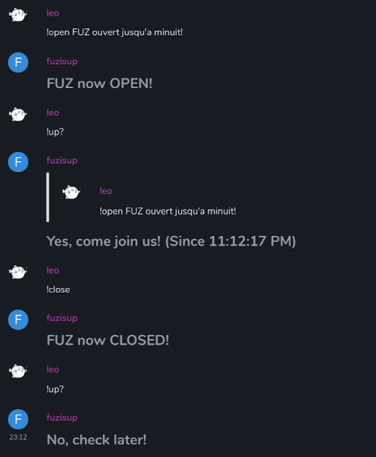

# fuzisup

Bot Matrix pour prevenir que le FUZ (hackerspace) est ouvert.



---

Commandes:

```
!open [informations] # Prevenir que le hackerspace est ouvert avec potentiellement un message
!close # Prevenir que le hackerspace est ferme (automatique apres 8 heures)
!up? # Savoir si le hackerspace est ouvert
```

---

Comment le lancer:

Recuperer l'access token d'un compte Matrix et l'inserer en tant que `access_token` dans la commande ci dessous et l'executer.

```
export ACCESS_TOKEN="access_token"
```

Installer les paquets requis,

```
npm install
```

puis,

```
node index.js
```

Ou voir avec [pm2](https://www.npmjs.com/package/pm2) pour lancer en tache de fond.